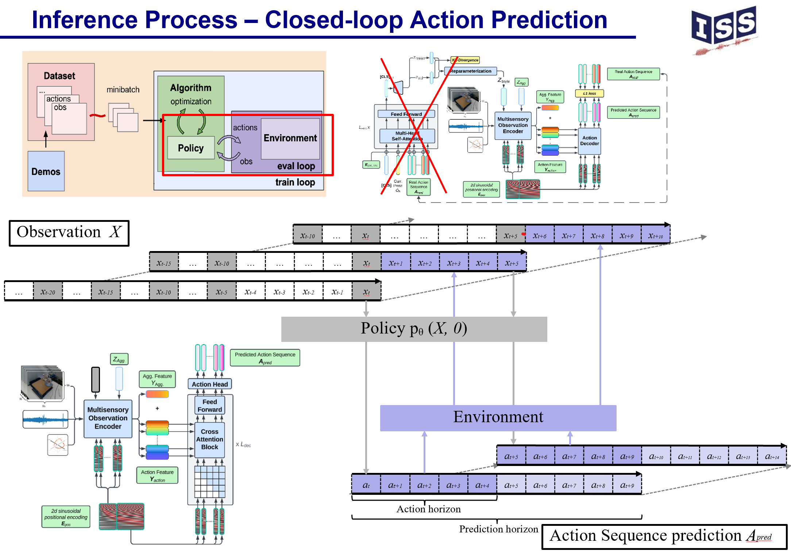

[//]: # (# smart_sensor_fusion)

[//]: # (Repository for Smart Sensor Fusion project)

[//]: # (## To install:)

[//]: # (* First, install requirements: `pip install -r requirements.txt`)

[//]: # (* Install package locally: `pip install -e .`)

[//]: # ()
[//]: # (## To prepare dataset for progress prediction)

[//]: # ("""https://github.com/JunzheJosephZhu/see_hear_feel""")

[//]: # (* First, download the example dataset from their [Google Drive]&#40;https://drive.google.com/drive/folders/13S6YcKJIIRKctB0SjdiaKEv_mvJEM_pk&#41;)

[//]: # (* Second, unzip and rename the folder to `data`, and place it under the project folder `smart_sensor_fusion`)

[//]: # (* Third, preprocess the data by running `python utils/h5py_convert.py`)

[//]: # (* Fourth, to split the training/testing dataset, run `python utils/split_train_val.py`)

[//]: # (* Brief explanation for the example dataset: Under data/test_recordings, each folder is an episode. timestamps.json contains the human demo actions and the pose history of the robot, while each subfolder contains a stream of sensory inputs.)

[//]: # ()
[//]: # (* Bosch raw dataset 2023-04-19 14-56-56.csv has 1636402 lines and 822 columns)

[//]: # ( )
[//]: # (## Run training)

[//]: # (* Remember to override the data_folder_path if your data folder is not saved at default location, see ```Help``` #2 for more detail)

[//]: # (* Train the model for transpose task: `python train.py --config-name config_transpose`)

[//]: # (* Train the model for progress_prediction task with default configuration: `python train.py --config-name config_progress_prediction`)

[//]: # (* Train the model for progress_prediction task with multiple configuration&#40;sweeper&#41;: `python train.py -cn config_progress_prediction -m`)

[//]: # (* Train the model for progress_prediction task using both vision and audio signal with multiple configuration&#40;sweeper&#41;:)

[//]: # (  * `python train.py -cn config_progress_prediction_vision_audio -m`)

[//]: # (* Train the model for short term drilling movement prediction task:)

[//]: # (  * `python train.py -cn config_progress_short_time_drilling_progress_prediction -m`)

[//]: # ()
[//]: # (## Run inference&#40;don't directly run the command line here&#41;)

[//]: # (* load the pretrained model based on the config and ckpt that stored in the results directory)

[//]: # (* Test the model for transpose task by running: )

[//]: # (  * `python scripts/demo_transpose_numbers.py 'inference.ckpt_path="path to .ckpt file" inference.test_seq=[0,1,1,1,1,6,7,8,9,8,0,1,2,3,4,5,6]'`)

[//]: # (* Test the model for progress_prediction task by running in terminal: )

[//]: # (  * `python scripts/demo_progress_prediction.py -cp 'path to the result folder that contain the config' 'models.inference.ckpt_path="name of ckpt file"'` )

[//]: # (  e.g. `python demo_progress_prediction.py -cp '../results/progress_prediction/see_hear_feel_insert_audio/vit_time_patch_128_51_standardpe/exp_dim_batchsize/256_64/09-05-18:27:24/.hydra/' 'models.inference.ckpt_path="09-05-18:27:24-jobid=0-epoch=7-step=1624.ckpt"'`)

[//]: # (* Test the model for progress_prediction task using both vision and audio signal by running in terminal: )

[//]: # (  * `python scripts/demo_progress_prediction_vision_audio.py -cp 'path to the result folder that contain the config' 'models.inference.ckpt_path="name of ckpt file"'` )

[//]: # (  e.g. `python demo_progress_prediction_vision_audio.py -cp '../results/progress_prediction/vision_audio/earlycat_newemb/exp_dim_batchsize/256_32/09-13-14:11:41/.hydra' 'models.inference.ckpt_path="09-13-14:11:41-jobid=0-epoch=13-step=5684.ckpt"'`)

[//]: # (* Test the model for short term drilling movement prediction task by running in both terminal and IDE &#40;here I switch to argparser for arguments input as the vanilla hydra initialization won't work in IDE&#41;:)

[//]: # (  * `python scripts/demo_short_drilling_progress_prediction.py --config_path '../results/short_term_drilling_progress_prediction/bautiro_drilling/earlycat_short_drilling_progress_prediction_vanilla/exp_vanilla_model/11-29-14:08:04/.hydra' --ckpt_path '11-29-14:08:05-jobid=0-epoch=9-step=240.ckpt')


[//]: # (## Help)

[//]: # (* #1 Hydra command line flags and override)

[//]: # (  * if using run configuration of IDE to pass the arguments:)

[//]: # (    * override hydra arguments example: `python train.py task_name='override_args'` &#40;check [here]&#40;https://hydra.cc/docs/advanced/override_grammar/basic/&#41;&#41;)

[//]: # (    * manipulate hydra config using command line: `python train.py --config-name config_transpose` &#40;check [here]&#40;https://hydra.cc/docs/advanced/hydra-command-line-flags/&#41;&#41;)

[//]: # (    * manipulate hydra config and override hydra args: `python train.py --config-name config_transpose task_name='override_args'`)

[//]: # (  * if using terminal to run the command line, because of interpretation of quote of shell, so you have to quote twice: )

[//]: # (    * override hydra arguments example: `python train.py 'task_name="override_args"'` &#40;check [here]&#40;https://hydra.cc/docs/advanced/override_grammar/basic/&#41;&#41;)

[//]: # (    * manipulate hydra config using command line: `python train.py --config-name config_transpose` &#40;check [here]&#40;https://hydra.cc/docs/advanced/hydra-command-line-flags/&#41;&#41;)

[//]: # (    * manipulate hydra config and override hydra args: `python train.py --config-name config_transpose 'task_name="override_args"'`)

[//]: # (* #2 About where datasets are saved and specifying the path to the folder:)

[//]: # (  * the default path to data folder is: '/fs/scratch/rng_cr_bcai_dl_students/jin4rng/data' for both my laptop and cluster, if your data are store on a different location, please override the data_folder_path by add the following flag when running train.py:)

[//]: # (    * data_folder_path='...' if using IDEs like pycharm or 'data_folder_path="..."' if running in terminal)

[//]: # (## update 4/9/2024)

[//]: # (* install miniforge3&#40;highly recommended, or it takes forever to solve environment&#41;)

[//]: # (* `conda env create -f conda_environment.yaml`)

[//]: # (* if using input pipeline only:)

[//]: # (  * everything about datasets, dataloader locate in src/datasets/dummy_robot_arm.py)

[//]: # (  * record dataset with tami_clap_candidata/tami_clap_candidate/record_demonstration_teleoperation.py)

[//]: # (  * important arguments:)

[//]: # (    * data_folder_path = '/home/jin4rng/Documents/cuponplate_robot_demos' &#40;folder path for recorded demos&#41;)

[//]: # (    * args.sampling_time = 100 &#40;which set resampling time interval to 100ms, namly resample frequency to 10Hz&#41; )

[//]: # (    * args.ablation = 'vf_vg' &#40;vf-fix cam, vg-gripper cam, ag/ah-audio, you may need to change camera serial number&#41;)

[//]: # (    * args.num_stack &#40;number of observation frames&#41; and args.frameskip &#40;interval between each observation&#41; e.g. after resampling with 10Hz, we have a sequence of observation/pose frames, e.g. 0.0s|0.1s|0.2s|0.3s|0.4s|0.5s|....|4.9s|5.0s|5.1s|...|6.0s|)

[//]: # (then at certain time step&#40;e.g. at 5.0s&#41;, we want to get 5 evenly distributed observations from the past 2.5s, then we should set args.num_stack=5&#40;we need 5 frames&#41; and args.frameskip=5&#40;5 frame interval between 2 observation&#41; so we get observations at |3.0s|3.5s|4.0s|4.5s|5.0s|)

[//]: # (    * args.len_lb: number of future action step used as label for prediction. e.g. after resampling with 10Hz, we have a sequence of observation/pose frames, e.g. 0.0s|0.1s|0.2s|0.3s|0.4s|0.5s|....|4.9s|5.0s|5.1s|...|6.0s|)

[//]: # (then at certain time step&#40;e.g. at 5.0s&#41;, we want to get 1s of future actions for ACT to predict, then we should set args.len_lb=10, then we output the pose of source robot at time step |5.0s|5.1s|5.2s|5.3s|5.4s|5.5s|5.6s|5.7s|5.8s|5.9s|6.0s| as action. The output will also include )

[//]: # (sample at 5.0s, please discard it during training.)

[//]: # (    * args.resized_height_v and args.resized_width_v: image interpolation, default 480x640)

[//]: # (  * explanation for output of dataloader, b=batch_size:)

[//]: # (    * 'previous_pos_quat': global pose of target robot at previous args.num_stack x args.frameskip time steps with shape [b, args.num_stack x args.frameskip, 7], orientation in quat form in w, x, y, z order )

[//]: # (    * 'previous_glb_pos_ori': global pose of target robot at previous args.num_stack x args.frameskip time steps with shape [b, args.num_stack x args.frameskip, 6], orientation in angle-axis form, computed using log_map with base [0, 1, 0, 0])

[//]: # (    * 'previous_gripper': gripper value at previous args.num_stack x args.frameskip time steps with shape [b, args.num_stack x args.frameskip, 1], )

[//]: # (    * 'future_pos_quat': global pose of source robot at future args.len_lb+1&#40;including current one&#41; time steps with shape [b, args.len_lb+1, 7], orientation in quat form in w, x, y, z order , )

[//]: # (    * 'future_glb_pos_ori': global pose of source robot at future args.len_lb+1&#40;including current one&#41; time steps with shape [b, args.len_lb+1, 6], orientation in angle-axis form, computed using log_map with base [0, 1, 0, 0], )

[//]: # (    * 'future_real_delta_direct': , )

[//]: # (    * 'future_real_delta': velocity of future args.len_lb+1&#40;including current one&#41; time steps with shape [b, args.len_lb+1, 6], )

[//]: # (    * 'future_relative_delta': , )

[//]: # (    * 'future_gripper': gripper value at future args.len_lb+1 time steps with shape [b, args.len_lb+1, 1], )

[//]: # (    * 'smooth_previous_pos_quat': smoothed version,)

[//]: # (    * 'smooth_previous_glb_pos_ori': smoothed version, )

[//]: # (    * 'smooth_previous_gripper': smoother version, )

[//]: # (    * 'smooth_future_pos_quat': smoother version, )

[//]: # (    * 'smooth_future_glb_pos_ori': smoother version, )

[//]: # (    * 'smooth_future_real_delta_direct': smoother version, )

[//]: # (    * 'smooth_future_real_delta': smoother version, )

[//]: # (    * 'smooth_future_relative_delta': smoother version, )

[//]: # (    * 'smooth_future_gripper': smoother version, )

[//]: # (    * 'observation':)

[//]: # (      * 'v_fix': fix cam images [b, args.num_stack, 3, args.resized_height_v, args.resized_width_v])

[//]: # (      * 'v_gripper': gripper cam images [b, args.num_stack, 3, args.resized_height_v, args.resized_width_v], )

[//]: # (      * 'a_holebase': holebase mic [b, self.num_stack x self.frameskip x 44100 x args.sampling_time / 1000, 1] )

[//]: # (      * 'a_gripper': holebase mic [b, self.num_stack x self.frameskip x 44100 x args.sampling_time / 1000, 1], )

[//]: # (    * 'start': time step of first observation, )

[//]: # (    * 'current': current time step&#40;end of observation, start of action&#41;, )

[//]: # (    * 'end': time step of last action, )

[//]: # (    * 'traj_idx': list contains the trajectory path e.g.'/home/jin4rng/Documents/cuponplate_robot_demos/demo_2024-04-09T10-59-45-858060')

[//]: # (* set params: resampline time in ms &#40;0.1hz => sampling_time=100&#41;)

[//]: # (* run vanilla ACT&#40;but changed decoder output layer to last layer&#41;`python train.py -cn)

[//]: # (config_dummy_aloha_vanilla)

[//]: # (-m)

[//]: # (models.model.replace_args.hidden_dim=512 models.model.replace_args.output_layer_index=-1 trainers.launch_trainer.repeat_trial=1       datasets.dataloader.args.resized_height_v=480)

[//]: # (      datasets.dataloader.args.resized_width_v=640)

[//]: # (output_name=aloha_baseline data_folder_path='/home/jin4rng/Documents/cuponplate_robot_demos' datasets.dataloader.args.sampling_time=100`)

|                             |
|:-------------------------------------------------:|
|             **Universität Stuttgart**             |
| Institut für Signalverarbeitung und Systemtheorie |
|               Prof. Dr.-Ing. B. Yang              |
|                        |

# Master's thesis D1497

# Smart Sensor Fusion for Robotic Manipulation
## Student
| Name       | Haolin Jiang                     |
|------------|----------------------------------|
| Major      | Elektro- und Informationstechnik |
| Begin      | 15.01.2024                       |
| End        | 15.07.2024                       |
| Supervisor | Andras Gabor Kupcsik             |

## Abstract
This master thesis presents an innovative approach to robotic manipulation through
 smart sensor fusion, with the goal of enhancing the capabilities of robots to perform
 complex tasks with greater accuracy through the usage of State-of-the-Art imitation
 learning policies and multimodal sensor integration. An end-to-end robot manipulation pipeline was developed using the Franka Panda robot arm equipped with
 camera and contact microphone, encompassing multisensory human demonstration
 collection via teleoperation, PyTorch-based training pipelines, and multi-processing
 closed-loop inference mechanism. Central to this system is the design and implementation of a sophisticated multimodal encoder capable of processing and integrating
 diverse sensory inputs to extract rich multimodal joint space representations. These
 representations are then utilized by a transformer-based downstream action decoder
 to predict sequences of future actions, thereby enabling smooth and rapid action
 execution. A conditional variational autoencoder framework is employed to address
 the challenges posed by noisy human demonstrations. The effectiveness of the model
 was validated through multiple real world experiments involving vision, audio, and
 proprioception inputs, demonstrating the potential of smart sensor fusion in robotic
 manipulation, showcasing the model’s capability to perform precise and complex
 tasks with smooth and accurate actions.


Human demonstration is recorded through teleoperation:

Visualization of recorded demonstration:

Structure of observation encoder and corresponding multi-modality regularization:


Visualization of inference process:

We designed 2 different tasks: pouring task & cup rotation task


The results and ablation study:

Visualization of latent space and the effect of self-supervised multimodal representation learning:

